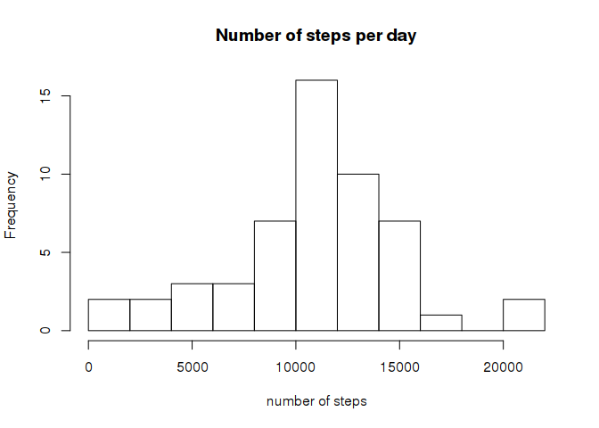
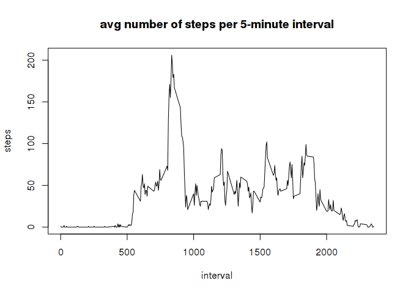
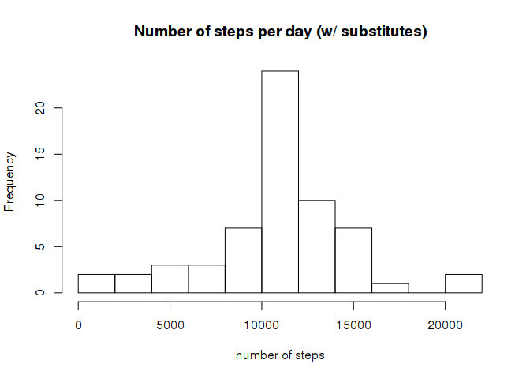
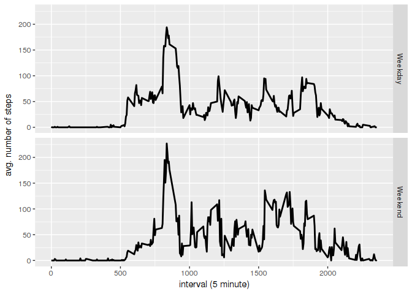

## Getting the data set

Download and unzip the dataset of the personal activity monitoring device.


```r
if(!file.exists('activity.zip'))
    download.file("https://d396qusza40orc.cloudfront.net/repdata%2Fdata%2Factivity.zip", destfile="activity.zip")

if(!file.exists('activity.csv'))
    unzip('activity.zip')
```

Read the data from the CSV.
The variables included in this dataset are:

- steps: Number of steps taking in a 5-minute interval (missing values are coded as NA)
- date: The date on which the measurement was taken in YYYY-MM-DD format
- interval: Identifier for the 5-minute interval in which measurement was taken


```r
activity <- read.csv('activity.csv')
```

### What is mean total number of steps taken per day?

```r
activity_clean <- activity[!is.na(activity$steps),]
total_steps <- activity_clean %>% group_by(date) %>% summarize(steps=sum(steps))
hist(total_steps$steps, xlab = "number of steps", main="Number of steps per day", breaks=10)
```

<!-- -->

Calculate and report the mean and median of the total number of steps taken per day


```r
mean_steps_day <- mean(total_steps$steps)
median_steps_day <- median(total_steps$steps)
print(c("mean", mean_steps_day))
```

```
## [1] "mean"             "10766.1886792453"
```

```r
print(c("median", median_steps_day))
```

```
## [1] "median" "10765"
```

### What is the average daily activity pattern?

Make a time series plot (i.e. type = "l") of the 5-minute interval (x-axis) and the average number of steps taken, averaged across all days (y-axis).


```r
steps_per_interval <- activity_clean %>% group_by(interval) %>% summarize(steps=as.integer(mean(steps)))
plot(steps_per_interval, type='l', main='avg number of steps per 5-minute interval')
```

<!-- -->

Which 5-minute interval, on average across all the days in the dataset, contains the maximum number of steps?


```r
max_steps <- max(steps_per_interval$steps)
interval_max <- steps_per_interval[which.max(steps_per_interval$steps),]
print(interval_max)
```

```
## # A tibble: 1 × 2
##   interval steps
##      <int> <int>
## 1      835   206
```
The interval with the max number of steps (206) is 835.


### Inputing missing values

Calculate and report the total number of missing values in the dataset (i.e. the total number of rows with NAs)


```r
sum(complete.cases(activity)==FALSE)
```

```
## [1] 2304
```

Devise a strategy for filling in all of the missing values in the dataset. The strategy does not need to be sophisticated. For example, you could use the mean/median for that day, or the mean for that 5-minute interval, etc.

I've chosen to substitute the mean for the given 5-minute interval regardless of the date. This is easy because that's already available in the ``steps_per_interval`` dataframe we calculated above.


```r
activity_missing <- activity[is.na(activity$steps),]
activity_missing <- merge(activity_missing, steps_per_interval, by="interval", sort=FALSE)[,c("steps.y","date","interval")]
names(activity_missing) <- c("steps", "date", "interval")
# add the augmented data to the data that was clean in the first place:
activity_with_substitutes <- rbind(activity_clean, activity_missing)
```

Make a histogram of the total number of steps taken each day and Calculate and report the mean and median total number of steps taken per day.  (this is the same histogram code as above, but operating on the new dataframe with substitutes)
 

```r
total_steps <- activity_with_substitutes %>% group_by(date) %>% summarize(steps=sum(steps))
hist(total_steps$steps, xlab = "number of steps", main="Number of steps per day (w/ substitutes)", breaks=10)
```

<!-- -->

```r
mean_steps_day_w_subst <- mean(total_steps$steps)
median_steps_day_w_subst <- median(total_steps$steps)
print(c("mean (previous):", mean_steps_day, "mean (w/subst):", mean_steps_day_w_subst))
```

```
## [1] "mean (previous):" "10766.1886792453" "mean (w/subst):" 
## [4] "10749.7704918033"
```

```r
print(c("median (previous):", median_steps_day, "median (w/subst):", median_steps_day_w_subst))
```

```
## [1] "median (previous):" "10765"              "median (w/subst):" 
## [4] "10641"
```

Do these values differ from the estimates from the first part of the assignment? What is the impact of imputing missing data on the estimates of the total daily number of steps?

The impact seems minor. Both the mean and the median go down just ever so slightly.


### Are there differences in activity patterns between weekdays and weekends?

For this part the weekdays() function may be of some help here. Use the dataset with the filled-in missing values for this part.

Create a new factor variable in the dataset with two levels – “weekday” and “weekend” indicating whether a given date is a weekday or weekend day.


```r
activity_with_substitutes$day <- weekdays(as.Date(activity$date))
activity_with_substitutes$weekend <- as.factor(activity_with_substitutes$day=='Saturday' | activity_with_substitutes$day=='Sunday')
levels(activity_with_substitutes$weekend) <- c("Weekday", "Weekend")
```

Make a panel plot containing a time series plot (i.e. type = "l") of the 5-minute interval (x-axis) and the average number of steps taken, averaged across all weekday days or weekend days (y-axis). 


```r
steps <- activity_with_substitutes %>% group_by(interval, weekend) %>% summarize(steps=as.integer(mean(steps)))
gg <- ggplot(steps, aes(interval, steps))+facet_grid(weekend~.)+geom_line(size=1)
gg <- gg + xlab("interval (5 minute)") + ylab("avg. number of steps")
print(gg)
```

<!-- -->

During the weekend people walk more, and most of the walking is done in the morning.
